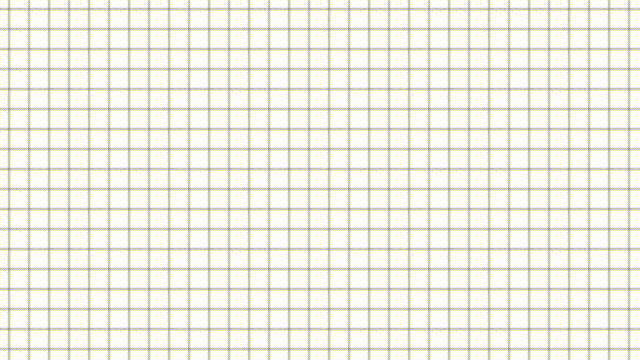

# game-of-life

Implementing [Conway's Game of Life](https://en.wikipedia.org/wiki/Conway's_Game_of_Life) in [DragonRuby](https://dragonruby.itch.io/dragonruby-gtk)!

If you'd like to see it in action, you can [download it from itch.io](https://nchlswhttkr.itch.io/game-of-life)!

<!--
TODO
* Start from common templates (ie glider gun)
-->

---

Cells can be toggled by clicking and dragging.

|             |                              |
| ----------- | ---------------------------- |
| `SPACE`     | Start/stop                   |
| `UP`/`DOWN` | Increase/decrease step speed |
| `BACKSPACE` | Stop and reset cells         |

---

### v0.2

- Cells can be reset
- Many cells can be toggled by click-dragging
- Cells will now wrap around

### v0.1

Initial release
